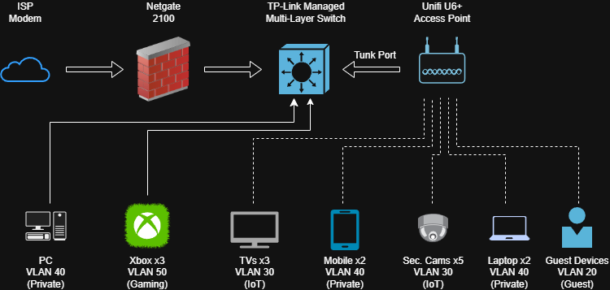
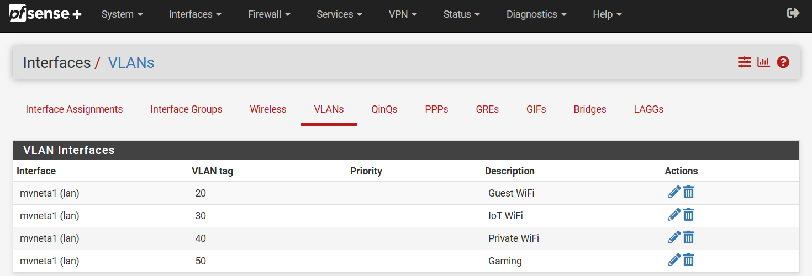
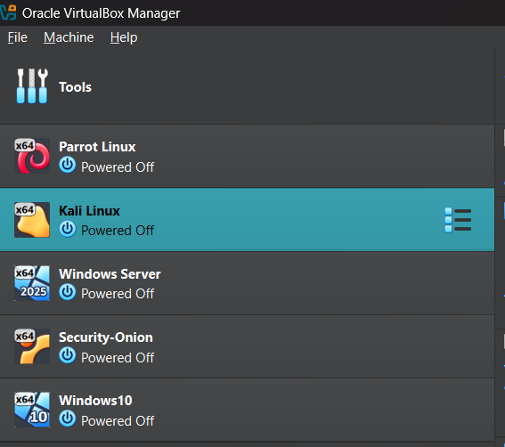

                                                    | Home Lab |         
                                                    ------------
                                                    
I designed and maintain a home networking environment used to develop practical skills in networking, security, and systems administration.

                                                    | Equipment |
                                                    -------------          

                                               - Netgate 2100 Firewall
                                            - TP-Link 24-Port PoE Switch
                                              - UniFi U6+ Access Point
                                                    - ISP Modem
                                                   - VirtualBox

                                                    | Technologies |
                                                    ----------------
                                                              
                                                 - VLAN Segmentation
                                                 - Inter-VLAN Routing
                                                       - DHCP
                                                  - Firewall Management
                                                      - IDS/IPS
                                                   - Virtualization

                                                 | VLAN Documentation |
                                                 ----------------------

                                                    VLAN 20 (Guests)
                                                    VLAN 30 (IoT Devices)
                                                    VLAN 40 (Private)
                                                    VLAN 50 (Gaming)

                                                  | Firewall Strategy | 
                                                  ---------------------

                                        - Guest devices cannot access trusted networks.
                                  - IoT devices are isolated from management systems.
                              - Administrative interfaces are restricted to management VLANs.

                                                     | Virtualization |
                                                     ------------------
                                                     
                                                      - VirtualBox
                                                      - Kali Linux
                                                      - Parrot Linux
                                                      - Security Onion
                                                      - Ubuntu Server
                                              

                                                  | Inter-VLAN Routing |
                                                  
                      - Implemented VLAN segmentation and verified communication between authorized networks.

                                                    | IDS/IPS Testing |
                                                    -------------------
                                                    
                            - Tested intrusion detection capabilities and reviewed generated alerts.

                                                | Troubleshooting Examples |
                                                 ---------------------------
                                                 
                                                - Trunk Port Misconfiguration
                                      Issue: Devices could not communicate across VLANs.
                          Resolution: Configured 802.1Q trunking correctly and verified VLAN propagation.

                                                    | Future Plans |
                                                     ---------------
                                                     
                                            - Complete additional CCNA labs
                                          - Learn Python network automation
                                          - Expand virtualization environment
                                              - Implement Active Directory

                              
                                                        | Goals |
                                                        ---------

This lab is used to strengthen my understanding of networking concepts and prepare for industry certifications such as the CCNA.

                                                    | Network Topology |

                                                    | pfSense Dashboard |

                                                    | Virtual Machines |
                                                    

